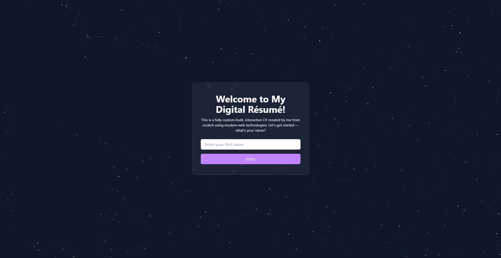

<p align="center">
  
</p>

# 👨‍💻 Min CV-nettside – Presentasjon med stil og struktur

Velkommen til min personlige CV-side laget med **Next.js** og **Tailwind CSS**.  
Nettsiden presenterer min bakgrunn, ferdigheter og prosjekter på en enkel, moderne og responsiv måte.

---

## 🧭 Hva er dette prosjektet?

Prosjektet ble laget som en digital versjon av min CV og et frontend-eksperiment med Next.js.  
Målet er å presentere meg selv på en profesjonell og teknisk måte – med fokus på design, struktur og lesbarhet.

---

## 🚀 Kom i gang

### 1. Klon prosjektet

```bash
git clone https://github.com/dittbrukernavn/my-cv-site.git
cd my-cv-site
```

### 2. Installer avhengigheter

```bash
npm install
```

### 3. Start utviklingsserveren

```bash
npm run dev
```

Åpne [http://localhost:3000](http://localhost:3000) i nettleseren din.

---

## 🛠️ Teknologier brukt

- **Next.js** – React-rammeverk med SSR
- **Tailwind CSS** – Utility-first stilark
- **React** – UI-komponenter
- **JavaScript / JSX**
- **PostCSS** – CSS-prosessering

---

## 🗂️ Prosjektstruktur

```
my-cv-site/
├── app/              # Sider og routing
├── components/       # UI-komponenter
├── public/           # Bilder og statiske filer
├── styles/           # Globale stilark
├── .env.local        # Miljøvariabler (privat)
├── package.json      # Scripts og avhengigheter
└── tailwind.config.js # Tailwind-konfigurasjon
```

---

## 📸 Eksempel på nettsiden

<p align="center">
  
</p>

---

## ✨ Hva inneholder siden?

- 👤 Om meg-seksjon
- 💼 Erfaring og utdanning
- 🛠️ Ferdigheter og teknologi-stack
- 📂 Prosjekter med lenker
- 📞 Kontaktinformasjon

---

## 🔧 Videre utvikling

Planer for fremtiden:
- Mørk modus
- PDF-nedlasting av CV
- Animasjoner og interaktivitet

---

## ✍️ Signatur

```
//  One bug to find them,
//  One fix to bring them all,
//  And in the darkness bind them.
```

---

## 📬 Kontakt

Send meg gjerne en melding hvis du ønsker å samarbeide eller gi tilbakemelding!

---